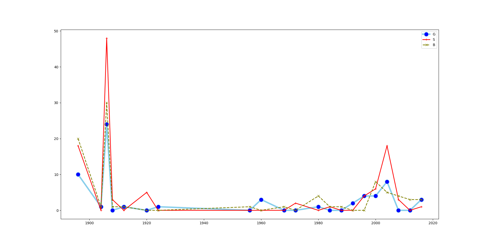

# 11 Multi Line Chart (part1)


#### **Description :**
Pada pembahasan pada video sebelumnya kita telah membuat line chart dengan single line yaitu untuk Total perolehan mendali  negara Yunani. Nah, kali ini kita akan membuat multi line chart dengan banyaknya total perolehan mendali untuk Gold, Silver dan Bronze. Jadi nantinya garis yang ditampilkan ada 3 garis.

Sebelumnya kita harus mengurutkan data menurut tahun karena untuk melihat dari tahun terlama sampai tahun terbaru dengan perintah
```
gre = gre.sort_values(by=['Year'])
gre.head()
```
*Output :*
| Year | NOC | Total | None | G  | S  | B  |
|------|-----|-------|------|----|----|----|
| 1896 | GRE | 48    | 0    | 10 | 18 | 20 |
| 1904 | GRE | 2     | 0    | 1  | 0  | 1  |
| 1906 | GRE | 102   | 0    | 24 | 48 | 30 |
| 1908 | GRE | 4     | 0    | 0  | 3  | 1  |
| 1912 | GRE | 2     | 0    | 1  | 0  | 1  |

Selanjutnya, kita buatlah Multi Line Chart dengan banyaknya total perolehan mendali untuk Gold, Silver dan Bronze dengan perintah
```
plt.figure(figsize=(20,10))
plt.plot('Year', 'G', data = gre, marker='o', markerfacecolor='blue', markersize =12, color = 'skyblue', linewidth = 4)
plt.plot('Year', 'S', data= gre, marker='+', color = 'red', linewidth = 2)
plt.plot('Year', 'B', data= gre, marker = 'x', color = 'olive', linewidth=2, linestyle='dashed')
plt.legend()
plt.show()
```
*Output :*


Terlihat lebih mudah dan lebih terlihat perbedaan antara total perolehan mendali untuk Gold, Silver dan Bronze. 