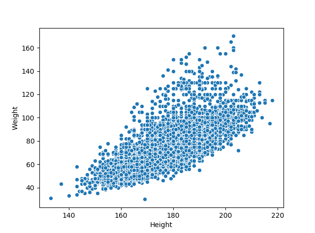
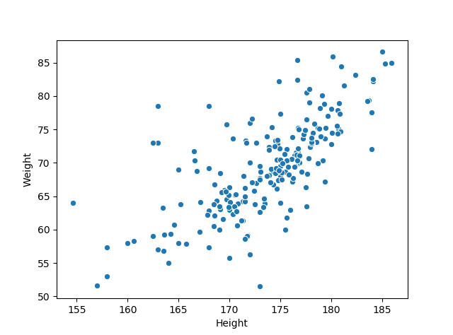

# 13 Scatter Plot


#### **Description :**
Scatter Plot merupakan titik data dari hubungan antara variabel pada sumbu x dan sumbu y. Pada kasus ini kita akan mengetahui persebaran data dari hubungan antara nilai sumbu x (```Height```) dan sumbu y (```Weight```). 
```
sns.scatterplot(x='Height', y='Weight', data=df)
plt.show()
```
*Output :*


Didapatkan scatter plot dari gambar diatas mempunyai pengaruh positif karena scatter plot yang didapatkan semakin besar ```Height``` semakin besar ```Weight``` pada banyak hubungan data. Mari kita mencoba untuk melihat dari rata-rata setiap negara
```
average = df.groupby('NOC')['Height','Weight'].mean()
sns.scatterplot(x='Height', y='Weight', data=average)
plt.show()
```
*Output :*


Pada output diatas didapatkan nilai rata-rata ```Height``` dan ```weihght``` dari masing-masing negara. Didapatkan ketika ```Height``` semakin besar maka ```Weight``` semakin besar pula. 