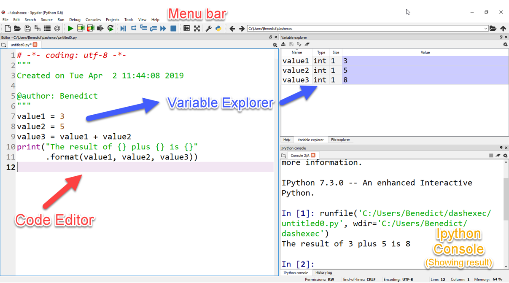

# 01 Intro to Spyder


#### **Description :**
Pada Video Kali ini, kita akan mengenalkan apa itu Spyder IDE. IDE atau _Integrated Development Environment_ merupakan salah satu aplikasi dimana kita dapat memasukkan code sekaligus menjalankannya hingga kemudian, kita dapat melakukan debugging terhadap kasalahan penulisan code maupun kesalahan algoritma yang kita masukkan.

Spyder umumnya sudah langsung terinstalasi ketika kita menginstall Anaconda, kita dapat temukan di **Anaconda Navigator**. 


Berikut adalah menu tampilan awal pada Spyder :



di Video Selanjutnya, kita akan mempelajari tentang interactive data visualization dengan Plotly, untuk itu diharapkan teman-teman terlebih dahulu menginstall plotly dengan memasukkan perintah berikut di anaconda prompt :

```
pip install plotly
```


