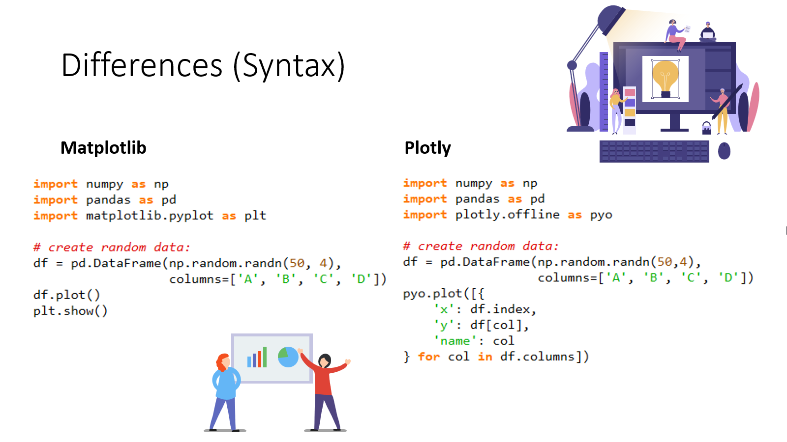
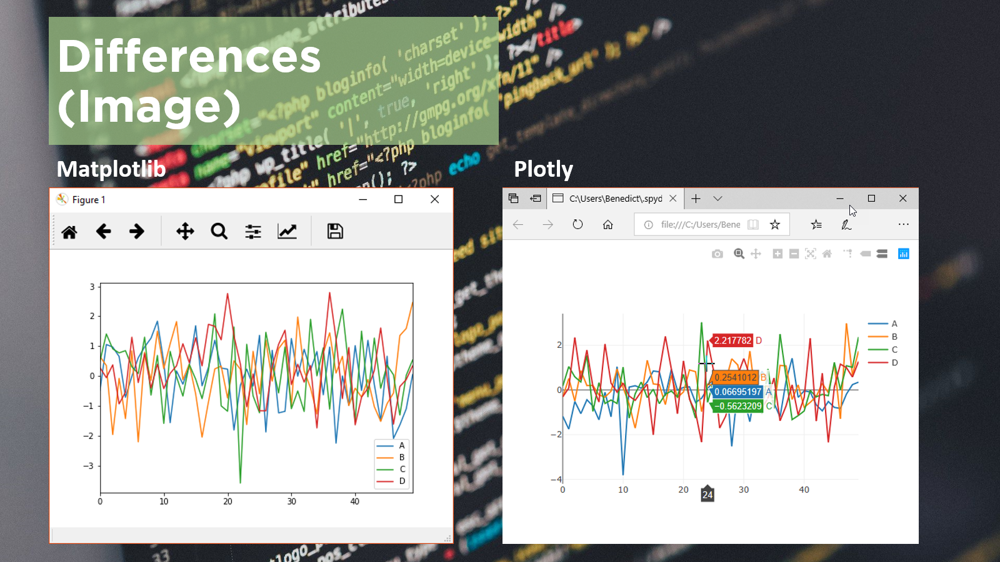

# 02 Matplotlib vs Plotly

#### **Description :**
Kita akan sedikit mereview apa saja yang telah kita pelajari berkaitan dengan materi Data Visualization pada python. Pertama kali kita tentunya sudah mempelajari apa itu __Matplotlib__, yakni data visualization paling dasar yang ada pada python. Matplotlib dibuat berdasarkan struktur yang sama pada Matlab, sehingga apabila teman-teman familiar dengan data visualization pada matlab, maka syntaxnya terlihat sama dengan syntax yg umum kita gunakan pada matplotlib.

Yang kedua ialah __Seaborn__, yakni library data visualization pada python yang menggunakan matplotlib sebagai backend-nya. Seaborn mampu membuat visualisasi data yang lebih cantik daripada matplotlib, dan dengan syntax yang lebih sederhana dari matplotlib. Namun kekurangannya ialah, jenis grafik pada Seaborn lebih sedikit daripada Matplotlib, karena Matplotlib mampu membuat hampir segala jenis grafik yang kita perlukan.

Pada Video kali ini, kita juga akan berkenalan dengan __Plotly__ yakni Sebuah perusahaan di bidang Business Intelligence yang berfokus pada BI Data Visualization. Plotly juga merilis sebuah open source library untuk Interactive data Visualization yang juga dinamai Plotly.

Teman-teman bisa mempraktekkan script berikut di Spyder sesuai dengan video

