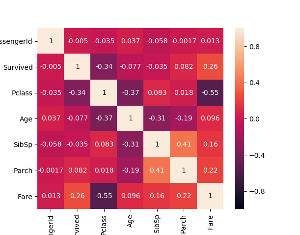

# 07 Correlation 2


#### **Description :**
Pada pelajaran kali ini kita akan memilih korelasi yang kuat dari data yang kita miliki dari korelasi yang kita dapatkan dari video sebelunya. 



Dari gambar diatas nilai yang paling baik misalnya korelasi antara ```Survived``` (sebagai target) dengan ```Pclass``` dengan korelasi -0.34 yang artinya semakin kecil nilai Pclass maka nilai survive akan semakin besar (bertolak belakang karena korelasi negatif). Oleh karena itu, ```Pclass``` sangat berpengaruh untuk ```Survived```. Nah, korelasi disini dapat digunakan sebagai feature selection salah satunya seperti ```Pclass```. 

Bisa diperhatikan kembali untuk nilai feature yang memiliki korelasi yang tinggi yang disebut multikolinearitas. Seperti, ```SibSp``` dengan ```Parch``` mempunyai korelasi sebesar 0.41, nilai tersebut cukup besar oleh karena itu terdapatnya multikolenieritas. Oleh karena itu salah satunya dapat dihapus dengan melihat korelasi dengan target (```Survived```), maka korelasi yang paling kecil yaitu ```SibSp``` dapat dihapus. 
